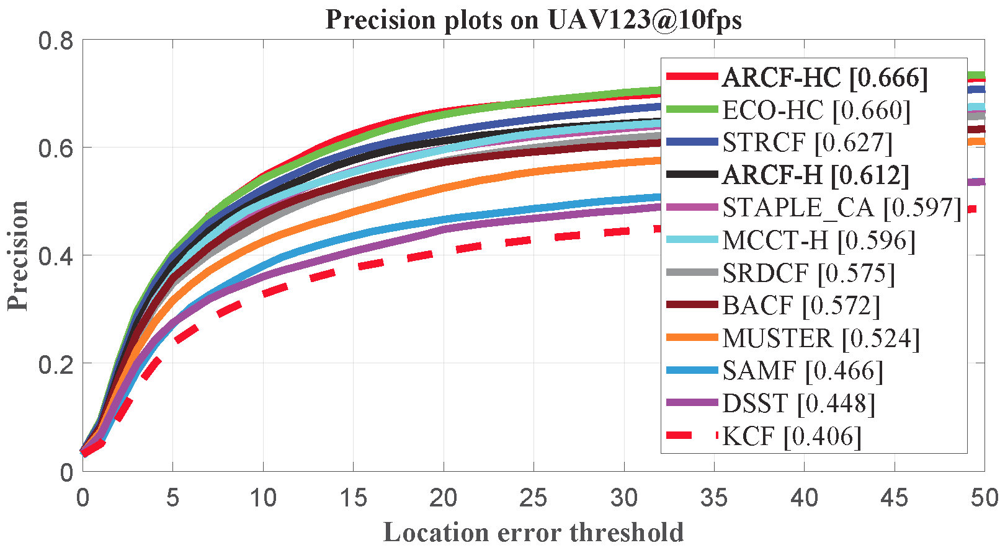
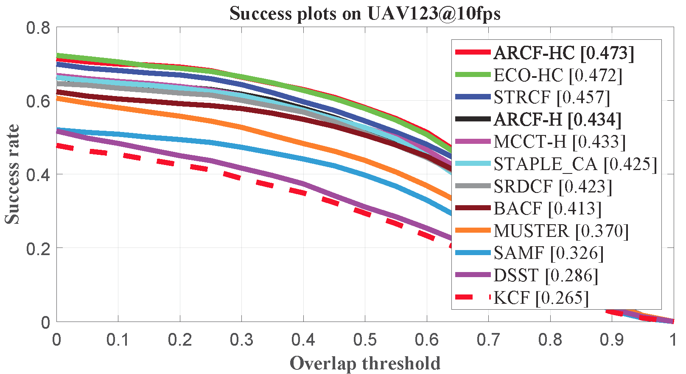
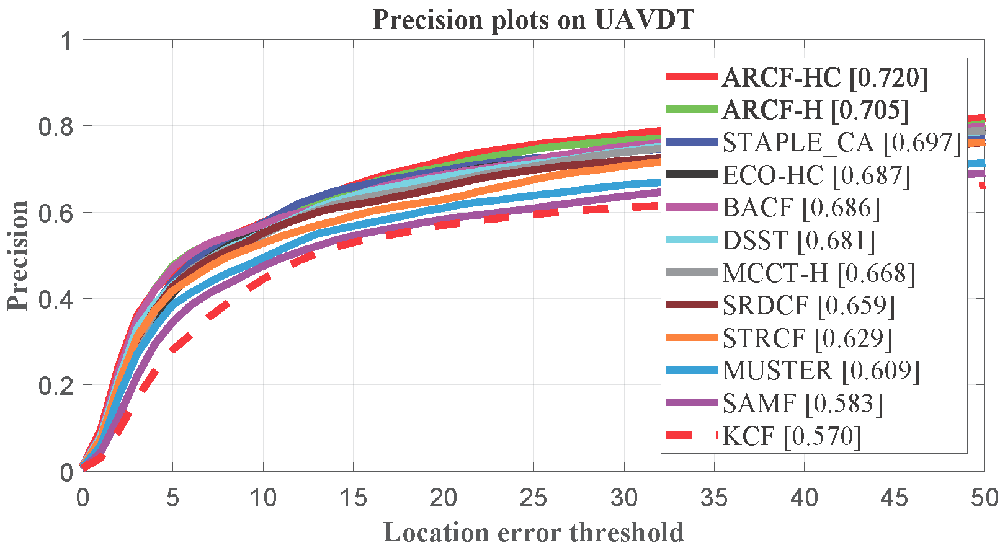
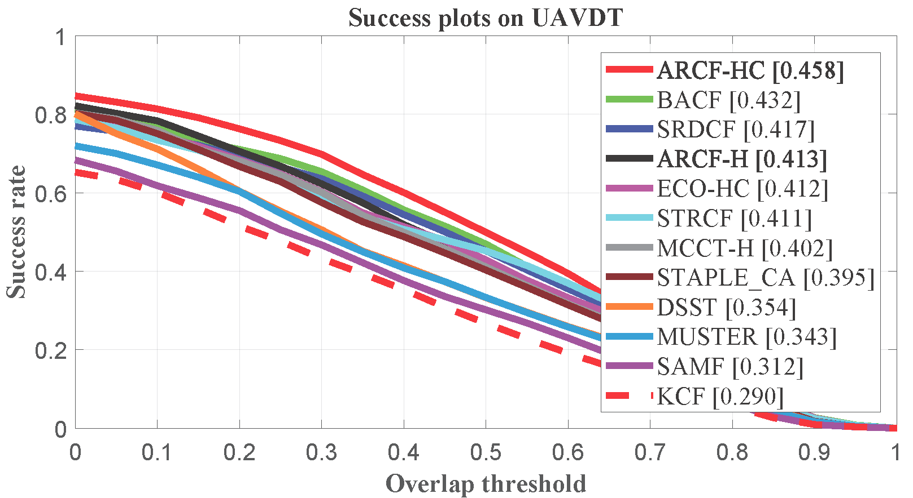
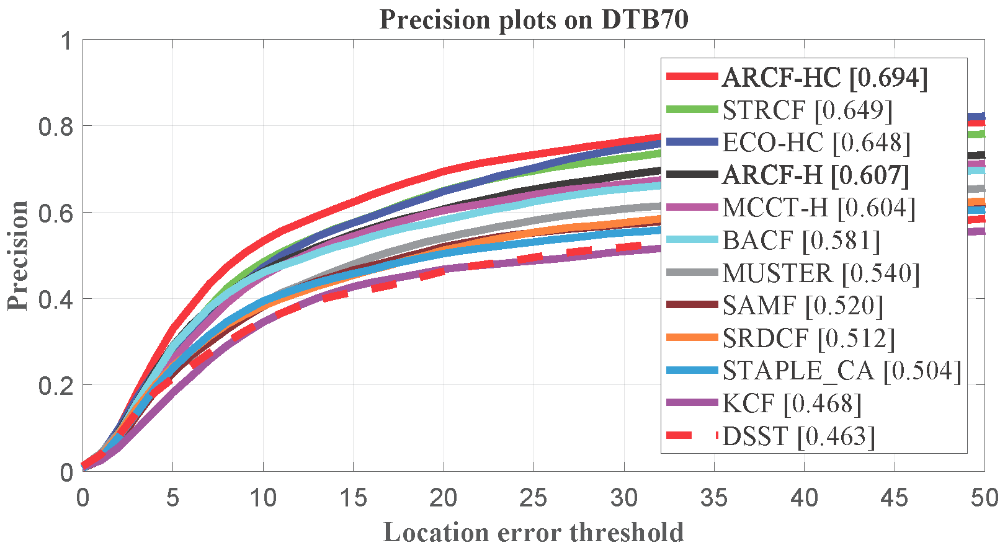
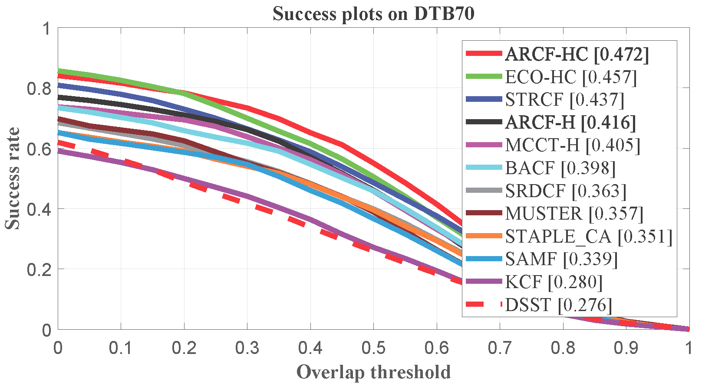

# Learning Aberrance Repressed Correlation Filters for Real-Time UAV Tracking (ICCV 2019)

Matlab implementation of our Aberrance Repressed Correlation Filters (ARCF) tracker.

| **Test passed**                                              |
| ------------------------------------------------------------ |
| |

# Abstract 
>Traditional framework of discriminative correlation filters (DCF) is often subject to undesired boundary effects. Several approaches to enlarge search regions have been already proposed in the past years to make up for this shortcoming. However, with excessive background information, more background noises are also introduced and the discriminative filter is prone to learn from the ambiance rather than the object. This situation, along with appearance changes of objects caused by full/partial occlusion, illumination variation, and other reasons has made it more likely to have aberrances in the detection process, which could substantially degrade the credibility of its result. Therefore, in this work, a novel approach to repress the aberrances happening during the detection process is proposed, i.e., aberrance repressed correlation filter (ARCF). By enforcing restriction to the rate of alteration in response maps generated in the detection phase, the ARCF tracker can evidently suppress aberrances and is thus more robust and accurate to track objects. Considerable experiments are conducted on different UAV datasets to perform object tracking from an aerial view, i.e., UAV123, UAVDT, and DTB70, with 243 challenging image sequences containing over 90K frames to verify the performance of the ARCF tracker and it has proven itself to have outperformed other 20 state-of-the-art trackers based on DCF and deep-based frameworks with sufficient speed for real-time applications.

# Publication and citation

ARCF tracker is proposed in our paper accepted by ICCV 2019. 
Detailed explanation of our method can be found in the paper:

Ziyuan Huang, Changhong Fu, Yiming Li, Fuling Lin, and Peng Lu.

Learning Aberrance Repressed Correlation Filters for Real-Time UAV Tracking.

In Proceedings of the IEEE International Conference on Computer Vision (ICCV), 2019.

The paper can be downloaded [here](https://arxiv.org/abs/1908.02231).

Please cite the above publication if you compare ARCF tracker in your work. Bibtex entry:

@Inproceedings{Huang2019ICCV,
title={Learning Aberrance Repressed Correlation Filters for Real-Time UAV Tracking},
author={Huang, Ziyuan and Fu, Changhong and Li, Yiming and Lin, Fuling and Lu, Peng},
booktitle={ICCV},
year={2019},
}

# Contact 
Ziyuan Huang

Email: ziyuan.huang@u.nus.edu

Changhong Fu

Email: changhong.fu@tongji.edu.cn

# Demonstration running instructions

Running demonstration of this tracker is very easy so long as you have MATLAB. Just download the package, extract it and follow two steps:
1. Config seq name in `configSeqs_demo_for_ARCF.m`,
2. Run `ARCF_Demo_single_seq.m`,
and the Demo should be running.

>This code is compatible with UAV123 benchmark. Therefore, if you want to run it in benchmark, just put ARCF folder in `trackers`, and config sequences and trackers according to instructions from UAV123. This should also do it.

# Results on UAV datasets

### UAV123@10fps

### UAVDT

### DTB70

# Acknowledgements

We thank the contribution of `Hamed Kiani`, `Feng Li`, Dr. `Martin Danelljan` for their previous work BACF, STRCF and ECO. The feature extraction modules are borrowed from the ECO tracker (https://github.com/martin-danelljan/ECO) and STRCF tracker (https://github.com/lifeng9472/STRCF) and some of the parameter settings and functions are borrowed from BACF (www.hamedkiani.com/bacf.html) and STRCF.

